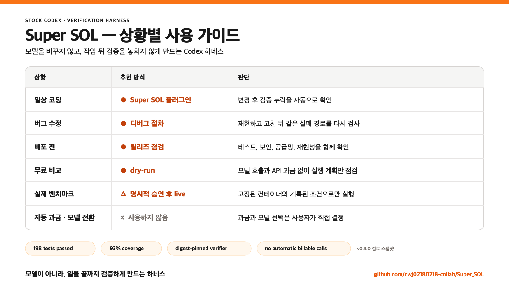

# Super SOL

[](https://github.com/cwj02180218-collab/Super_SOL/actions/workflows/ci.yml)
[](https://github.com/cwj02180218-collab/Super_SOL/actions/workflows/container-security.yml)
[](https://www.python.org/)
[](LICENSE)

Super SOL은 두 가지를 한 저장소에 담습니다.

1. 평소 Codex 작업에서 고위험 실패 조건만 선택적으로 보강하는 초보자용 Codex 플러그인
2. 모델과 작업 절차를 통제된 조건에서 비교하는 선택형 벤치마크 하네스

플러그인은 현재 열려 있는 순정 Codex 작업 안에서만 동작합니다. 별도 API 키, MCP 서버,
백그라운드 서비스가 없고 플러그인 자체의 **추가 API 과금 호출 없음**이 기본값입니다. 현재
Codex 작업 자체의 사용량은 그대로 발생하므로 비용 0을 보장한다는 뜻은 아닙니다. Super SOL은
새 모델이나 온톨로지가 아니라, 실제 작업과 검증 누락을 관리하는 품질관리 하네스입니다.



## v0.9.1-rc1 Selective Verification prerelease

`v0.9.1-rc1 is a prerelease.` Exact normalized `gpt-5.6-sol` and `gpt-5.6-terra` profiles can use
selective semantic intervention for high-confidence concurrency, security, migration, and failure
semantics work. A turn can receive one prompt context. After two successful distinct edits without
an observed verifier, it can receive one evidence context. Both channels are one-shot and every
context is bounded to 180 Unicode code points.

The loop fuse remains exact-Sol only. Unknown profiles and ambiguous tasks are observation-only.
There are no model calls, no retries, no continuations, no automatic model switches or subagents,
and no process killer. Quality uplift has not been established. The preregistered 240 valid slots
have not run, so v0.8.0 remains the stable release.

The candidate protocol uses 30 new tasks, raw/candidate crossover under Sol/high and Terra/xhigh,
and two repetitions. It requires noninferior semantic quality, token ratio at most 1.03, wall-time
ratio at most 1.05, and zero contamination or hidden-grader leakage. See
[`V0.9.1_PROMOTION_PROTOCOL.md`](docs/V0.9.1_PROMOTION_PROTOCOL.md) and
[`RELEASE_BRIEF_0.9.1RC1.md`](docs/RELEASE_BRIEF_0.9.1RC1.md). Both wheel and sdist store these release
assets under `fablized_sol/_release/v0_9_1/`.

## v0.9.0-rc1 Loop Fuse prerelease

`v0.9.0-rc1 is a prerelease.` It keeps v0.8 raw-first behavior and adds a bounded loop fuse only
when the normalized model identifier is exactly `gpt-5.6-sol`. Non-Sol profiles pass through without
active intervention. The v0.9 candidate does not make an additional API call, retry, start a
continuation, substitute a model, create a replacement agent, or use a process killer.

The tested limits are exact: passed verifier replay is blocked until edit; the third identical
no-progress result warns; fourth blocks; maximum depth is one; maximum 2 concurrent children;
maximum 3 total starts including failures. Manual compaction is excluded. The third no-progress
automatic `PostCompact` returns `continue:false`, and user input resets the turn budget. There is no
process killer: a sampler already in flight cannot be interrupted before a lifecycle hook, and no
`Stop` hook is installed.

Gate 0 attempt 5 completed for product candidate
`ec5a153e1487065f3f3a33aab5394ed48f453377`: 465/465 tests passed in 40.87s with 90.56% coverage;
Ruff, formatting, basedpyright, build, dependency lock, archive inventory, installed-wheel smoke,
container audit, and the stock Codex lifecycle passed. The privacy-safe 300-hook/150-floor latency
artifact has SHA-256 `6689e3b8b7d75f25ec5a5da4e2d5fcf7baf6d1d5523cbacd515a99564bdcec00`;
hook p95 was `59.684106236090884 ms` and paired incremental p95 was
`37.984207982663065 ms`, below the required 100/70 ms limits.

Gate 1 completed at 12/12, with 0 failures, 0 unexpected contexts, and `billable_calls: 0`; the
credential-stripped five-file suite passed 42/42 in 9.73s. Kernel network denial was required and
enforced, successful network operations were 0, corrupt recovery was evidenced, and named
credentials were absent. The plugin tree, manifest, replay report, and audit SHA-256 values are
`ab7ff273f66c0ea3a7472484a0ecca05b7a7aef5876d959129946443388d7f74`,
`9412d22d97e6558adb645b59be48de38f0d8187f4e83a8a61cc9b644197c98b5`,
`50219870b1ad89d72f03ed97e1125047e0315f226d278ae518e8f1dbe9cae048`, and
`db619a1a2d39459ac051db15fb310f05976901255862bdbeaa779ca593273332` respectively.

The original 32-slot Gate 2 has not run and remains **NOT RUN**; it was not retroactively
reinterpreted. A separate preregistered post-release crossover completed 192/192 valid slots across
Sol/high and Terra/xhigh,
with zero censored attempts or retries. Super SOL changed paired score by `+0.94` under Sol
(95% CI `[-2.08, +4.48]`) and `+2.36` under Terra (95% CI `[-0.52, +5.90]`), while paired token/time
ratios were `0.989/0.936` and `0.980/0.922`. Raw, Super SOL, and SOLTELU formed a shared quality tier;
Super SOL was the token/time efficiency leader inside that tier. The strict integrated promotion
decision still failed because the Sol CI lower bound was `-2.083`, below the preregistered `-2.0`
threshold. Quality uplift remains unproven and **v0.8.0 remains the stable release**.

See [`V0.9_POSTRELEASE_EVIDENCE.md`](docs/V0.9_POSTRELEASE_EVIDENCE.md) for the bounded aggregate
claim and hashes, [`V0.9_PROSPECTIVE_HOLDOUT_PROTOCOL.md`](docs/V0.9_PROSPECTIVE_HOLDOUT_PROTOCOL.md)
for the next data-only decision, and [`V0.9_PROMOTION_PROTOCOL.md`](docs/V0.9_PROMOTION_PROTOCOL.md)
for the original gate contract. The pre-publication record remains frozen in
[`RELEASE_BRIEF_0.9.0RC1.md`](docs/RELEASE_BRIEF_0.9.0RC1.md).
Both the wheel and sdist carry the same release assets. The wheel uses the stable package-data path
`fablized_sol/_release/v0_9/` for the plugin, v0.9 eval helpers, release docs, and replay evidence.

## v0.8 Sol-Gated 안정판

`0.8.0`은 **raw-first** 안정판입니다. 정규화한 모델 식별자가 정확히 `gpt-5.6-sol`일 때만,
실제 편집 뒤 첫 검증 결과가 관찰된 경우에 한해 **one model-visible injection**을 허용합니다.
모든 context는 180 Unicode code points 이하여야 합니다. `gpt-5.6-terra`, Luna, 누락·손상·알 수
없는 모델 메타데이터는 observation-only로 동작하며 model-visible context를 내보내지 않습니다.

자동 모델 전환, 추가 model call 또는 additional API call, 서브에이전트, 자동 재시도와 통과한
테스트 재실행은 없습니다. 동결 후보로 수행한 96/96 valid slots에서 Codex raw 대비 평균 점수는
동률, paired token은 2.33% 감소, wall time은 7.91% 증가했습니다. 사전등록한 모든 안정판 게이트를
통과해 **noninferior quality with bounded overhead**만 주장합니다. **quality uplift was not
proven**입니다. 전체 기준은 [`V0.8_PROMOTION_PROTOCOL.md`](docs/V0.8_PROMOTION_PROTOCOL.md), 실제
결과와 해시는 [`RELEASE_BRIEF_0.8.0.md`](docs/RELEASE_BRIEF_0.8.0.md)에 고정합니다.

**v0.8.0 is the stable release.** RC의 무료 검증 기록은
[`RELEASE_BRIEF_0.8.0RC1.md`](docs/RELEASE_BRIEF_0.8.0RC1.md)에 변경 없이 보존합니다.

## v0.5 Performance Amplifier 실패 후보

`0.5.0rc1`은 Plus 사용자의 실전 코딩
결과를 더 강한 raw 모델에 가깝게 만들 수 있는지 검증하는 개발 후보입니다. 일상 설치 명령은
현재 안정판을 가리킵니다. 당시 unseen holdout과 독립 감사 전에는 성능 증폭이나 Pro급 결과를
주장하지 않았습니다.

Orca clean-room에서 72 paid slots를 완료한 결과, v0.3.1은 raw와 품질이 같았지만 token
+26.86%, 시간 +30.86%였고, v0.4rc1은 품질 동률과 token -0.50%까지 개선했지만 시간
+11.08%로 사전등록 상한 +10%를 넘었습니다. 따라서 v0.4 Gate 2는 실행하지 않았습니다.
전체 근거는 [`BENCHMARK_POSTMORTEM_0.4.md`](docs/BENCHMARK_POSTMORTEM_0.4.md)에 고정합니다.

v0.5는 일반 지시문을 항상 주입하지 않습니다. 요청을 로컬에서 보수적으로 분류해 일반·모호·
설명 요청은 순정 경로로 통과시키고, 다음 네 영역만 짧은 전문 절차를 적용합니다.

- 동시성·공유 상태
- 인증·파일·입력 보안 경계
- 스키마 마이그레이션·호환성
- 부분 실패·원자성·재시도

구조적으로 인식한 검증이 실패했을 때만 같은 Codex turn 안에서 한 번의 표적 수정 context를
전달합니다. 별도 Codex 실행, API 호출, 모델 전환, 서브에이전트, 자동 재시도는 없습니다.
첫 줄의 `SUPER SOL OFF`로 해당 turn을 즉시 pass-through로 만들 수 있습니다.

| Cell | Model·effort | Plugin | 역할 |
| --- | --- | --- | --- |
| `terra-raw` | GPT-5.6 Terra / medium | off | Plus-efficient baseline |
| `terra-v05` | GPT-5.6 Terra / medium | v0.5 | 성능 증폭 후보 |
| `sol-high-raw` | GPT-5.6 Sol / high | off | Pro급 품질 기준선 |
| `sol-max-raw` | GPT-5.6 Sol / max | off | 최상단 참고치 |

주효과는 같은 모델·effort를 쓰는 `terra-v05 - terra-raw`입니다. `sol-high-raw`는 근접도를
재고 `sol-max-raw`는 승격 판정에 쓰지 않습니다. 정확한 +5점, -2점, token/time 1.15 상한과
T117~T124 봉인 규칙은 [`V0.5_PERFORMANCE_PROTOCOL.md`](docs/V0.5_PERFORMANCE_PROTOCOL.md)에
있습니다. 무료 Gate 0의 실제 통과 항목과 아직 막힌 유료 조건은
[`RELEASE_BRIEF_0.5.0RC1.md`](docs/RELEASE_BRIEF_0.5.0RC1.md)에 고정했습니다. 기존
`super-sol-codex-ab`은 v0.4 증거 재현용으로 보존합니다.

## 초보자용 설치

먼저 macOS/Linux는 `/usr/bin/python3 --version`, Windows는 `py -3 --version`으로 Python
3.9 이상을 확인합니다. 이 명령은 플러그인이 실제로 쓰는 실행기와 같습니다. macOS/Linux에서
`/usr/bin/python3`가 없거나 3.9보다 낮으면 훅을 승인하지 말고 운영체제 Python을 먼저
업데이트합니다. 벤치마크에는 별도로 Python 3.12가 필요합니다.

### 현재 안정판 v0.8.0 설치

v0.8.0은 현재 안정판입니다. 정식 배포본은 이 버전을 고정해 설치합니다.

```bash
codex plugin marketplace add cwj02180218-collab/Super_SOL --ref v0.8.0
codex plugin add super-sol@super-sol
codex plugin list
```

ChatGPT/Codex 데스크톱 앱을 다시 열고 새 작업을 시작한 뒤 `/hooks`를 확인합니다. 세-hook contract은
`UserPromptSubmit`, `PreToolUse`, `PostToolUse`이며, 종료 훅이나 다른 이벤트가 보이면 승인하지
마세요.
안정판은 `gpt-5.6-sol`에서만 실제
편집 뒤 첫 검증에 한 번의 의미 context를 전달합니다. Terra, Luna, 누락·손상·알 수 없는 모델은
observation-only이며 model-visible context를 내보내지 않습니다. 훅 내용이 업데이트되면 다시
승인하라는 안내가 나올 수 있습니다.
`--dangerously-bypass-hook-trust`는 일반 설치 절차로 권장하지 않습니다.

### v0.9.1-rc1 prerelease 설치

v0.8.0 is the stable release until the new 240-slot holdout passes. Install this candidate only to
evaluate its documented selective checks; it does not establish stable performance or uplift.

```bash
codex plugin marketplace add cwj02180218-collab/Super_SOL --ref v0.9.1-rc1
codex plugin add super-sol@super-sol
codex plugin list
```

After reopening ChatGPT/Codex Desktop, review `/hooks`. Sol and Terra may receive bounded selective
verification contexts, while the no-progress loop fuse remains Sol-only.

### 이전 v0.9.0-rc1 prerelease 설치

v0.8.0 is the stable release until Gate 2 completes. The v0.9 candidate can be installed only as a
prerelease for its documented hook surface and does not establish stable performance or uplift.

```bash
codex plugin marketplace add cwj02180218-collab/Super_SOL --ref v0.9.0-rc1
codex plugin add super-sol@super-sol
codex plugin list
```

After reopening ChatGPT/Codex Desktop, review `/hooks`. The shipped manifest has seven top-level
events and deliberately has no `Stop`: six loop lifecycle capability events (`PreToolUse`,
`PostToolUse`, `SubagentStart`, `SubagentStop`, `PreCompact`, and `PostCompact`) plus a separate
`UserPromptSubmit` reset check.

```text
이 오류를 고치고 테스트까지 해줘.
공개 배포 전에 안정성을 점검해줘.
이 저장소가 무엇을 하는지 초보자 기준으로 설명해줘.
```

플러그인은 요청을 로컬 규칙으로 일곱 의미 계약 또는 pass-through로 분류하지만 구현 전에는
context를 전달하지 않습니다. 프롬프트 원문, 명령, 도구 출력, 모델 출력, 환경변수는 저장하지
않습니다. 실제 편집 뒤 첫 검증에서만 잔여 의미 점검 또는 표적 수정 context 중 하나를 한 번
전달하며, 별도 모델 응답이나 새 Codex 프로세스를 자동 생성하지 않습니다.

### 새 버전으로 업데이트

```bash
codex plugin remove super-sol@super-sol
codex plugin marketplace remove super-sol
codex plugin marketplace add cwj02180218-collab/Super_SOL --ref vX.Y.Z
codex plugin add super-sol@super-sol
codex plugin list
```

`vX.Y.Z`를 설치할 새 태그로 바꿉니다. 앱을 다시 열고 `/hooks`의 경로와 이벤트를 다시 확인한 뒤
신뢰를 승인합니다. 태그로 고정한 설치는 `marketplace upgrade`만으로 다음 태그로 이동하지 않습니다.

### 플러그인만 삭제

```bash
codex plugin remove super-sol@super-sol
```

### 플러그인과 marketplace 모두 삭제

```bash
codex plugin remove super-sol@super-sol
codex plugin marketplace remove super-sol
```

이전 버전으로 돌아갈 때도 업데이트 절차와 같습니다. 단, Codex 플러그인을 포함하는 `v0.3.0`
이후 태그만 선택하고, marketplace 재등록 뒤 `codex plugin add`, `codex plugin list`, 앱 재시작,
`/hooks` 확인까지 마칩니다.
`codex plugin` 명령이 없다면 Codex를 먼저 업데이트하고, Python 실행 오류가 보이면 위 버전 확인부터
다시 합니다.

### 플러그인이 하지 않는 일

- `OPENAI_API_KEY`를 읽거나 요청하지 않습니다.
- OpenAI SDK, HTTP 클라이언트, 원격 MCP를 호출하지 않습니다.
- 모델이나 reasoning effort를 몰래 변경하지 않습니다.
- 일상 작업에서 서브에이전트를 자동 생성하지 않습니다.
- 모델 자체의 지능이나 capability ceiling을 높였다고 주장하지 않습니다.

알려진 단순 live 평가 명령과 `api.openai.com` 직접 호출은 명시적 승인 없이는 로컬 훅이
차단합니다. 다만 Codex 훅은 운영체제 보안 경계가 아니며 모든 미래 도구나 사용자가 직접 작성한
임의 코드를 가로챌 수는 없습니다. 강제 보안은 Codex 권한, 샌드박스, 조직 정책과 함께
구성해야 합니다.

## 모델 선택 안내

이 안내는 [OpenAI의 2026-07-09 GPT-5.6 정식 출시 발표](https://openai.com/index/gpt-5-6/)
기준이며, 실제 선택 가능 모델은 사용자 플랜과 워크스페이스 정책에 따라 다릅니다.

| 용도 | 권장 시작점 | 이유 |
| --- | --- | --- |
| 대부분의 일상 작업 | GPT-5.6 Terra, medium | 성능·속도·비용의 균형 |
| 어렵고 열린 문제 | GPT-5.6 Sol, medium부터 | 가장 높은 단일 모델 성능 |
| 명확하고 반복적인 대량 작업 | GPT-5.6 Luna, 낮은 effort부터 | 가장 빠르고 저렴한 계층 |

가장 낮은 충분한 effort에서 시작하고, 실제 실패나 부족한 결과를 확인한 뒤 올리는 방식을
권합니다. Codex 제품의 `max`는 특히 어려운 단일 작업, `ultra`는 명확히 분리 가능한 병렬
작업에만 적합합니다. Super SOL 플러그인은 이 선택을 자동으로 바꾸지 않습니다.

선택형 API 벤치마크는 고정된 OpenAI SDK가 지원하는 `none`, `minimal`, `low`, `medium`,
`high`, `xhigh`만 받습니다. `max`와 `ultra`는 현재 벤치마크 계약 밖입니다. 특히 `ultra`는
멀티에이전트 토폴로지를 바꾸므로 단일 에이전트 비교와 같은 셀에 섞을 수 없습니다.

## 벤치마크는 선택 사항

일상 플러그인에는 Python 3.9 이상만 필요하며 Docker와 API 키는 필요하지 않습니다. 아래
하네스는 모델별 성능·비용 가설을 실험할 때만 사용합니다.

### 개발 환경

```bash
uv python install 3.12
uv sync --locked --dev
```

### 무료 dry-run

매니페스트, 모델/effort 조합, 세션 ID, 출력 경로만 확인합니다. 모델 호출이 없습니다.

```bash
uv run super-sol-eval \
  --tasks eval/tasks.example.json \
  --output-dir .fablized/smoke \
  --run-id day0-smoke \
  --dry-run
```

기본 비교는 `gpt-5.6-terra/medium` 대 `gpt-5.6-sol/medium`입니다. 다른 조건은
`--product-model`, `--reference-model`, `--product-effort`, `--reference-effort`로 명시합니다.
모델과 effort뿐 아니라 task·fixture 내용, 사전등록 내용 식별값, 하네스 전체 내용, `uv.lock`,
해석기/플랫폼, 실제 설치된 런타임 의존성, 두 이미지 digest가 run/session 식별자와 plan event에
기록됩니다. 리포트는 이 식별자를 다시 계산하며 조건이 하나라도 바뀐 과거 grade를 거부합니다.

### 과금되는 live 평가

live 평가는 명시적으로 실행할 때만 가능합니다. 다음 네 조건을 모두 충족해야 합니다.

1. 로컬 셸에 `OPENAI_API_KEY`가 설정되어 있음
2. 서로 다른 verifier/grader 이미지가 `@sha256:...` digest로 고정됨
3. 실행 명령에 `--confirm-billable`이 있음
4. 사용자가 현재 모델 접근권한과 quota를 확인함

Codex에게 live 실행을 맡길 때는 요청의 별도 한 줄에 `SUPER SOL 유료 실행 승인`을 정확히
적어야 합니다. 설명이나 인용문 속 유사 표현은 승인으로 취급하지 않습니다.

```bash
uv run super-sol-eval \
  --tasks eval/tasks.example.json \
  --output-dir .fablized/live \
  --run-id day0-live \
  --product-effort medium \
  --reference-effort medium \
  --verification-image "$VERIFICATION_IMAGE" \
  --grader-image "$GRADER_IMAGE" \
  --confirm-billable
```

플래그가 없으면 이미지와 API 키가 있어도 실행 디렉터리를 만들기 전에 거부합니다. 실행 전 두
digest가 로컬에 실제로 존재하는지도 확인하므로 grader 누락을 모델 호출 뒤에 발견하지 않습니다.
live 평가는 일상 테스트나 CI에서 자동 실행되지 않습니다.

## 컨테이너 공급망

예제 verifier와 grader는 공식 `python:3.12-alpine`의 멀티플랫폼 digest와 pytest 전체
dependency tree의 hash를 고정합니다. 한 명령으로 두 이미지를 빌드하고 SPDX 2.3 SBOM을 먼저
남긴 뒤 두 이미지의 release gate를 모두 확인합니다.

```bash
uv run super-sol-container-audit \
  --repo-root . \
  --sbom-dir security/sbom
```

2026-07-11 로컬 release audit에서 두 이미지 모두 `0 Critical / 0 High`였고, 각각 58개
패키지를 기록한 SPDX SBOM이 생성됐습니다. GitHub의 container-security workflow도 같은
두 이미지에 대해 build, scan, SBOM을 수행하며 모든 Action을 전체 commit SHA로 고정합니다.

실제 live 실행용 digest는 로컬 레지스트리에서 생성합니다. 자세한 절차는
[`eval/verifier/README.md`](eval/verifier/README.md)를 참고하세요.

## 벤치마크 신뢰 경계

작업 매니페스트의 명령은 셸 문자열이 아니라 argv 배열입니다. fixture는 매니페스트 디렉터리
밖으로 나갈 수 없고 심볼릭 링크를 포함할 수 없습니다. 각 세션은 복사된 독립 workspace와
ledger를 가집니다.

| 증거 | 저장 위치 | 모델에게 보임 |
| --- | --- | --- |
| 분류, 로컬 도구 호출, gate 결과 | 세션 ledger | 필요한 도구 결과만 |
| arm, model, effort, provenance, 시간, token 사용량 | shadow stream | 아니요 |
| machine grader 통과 여부 | shadow stream의 terminal event | 아니요 |
| 외부 최종 결함 라벨 | run digest가 포함된 별도 grade 파일 | 아니요 |

모델이 호출하는 verifier와 사후 grader는 서로 다른 digest-pinned 이미지입니다. 두 컨테이너는
부모 환경변수와 API 키를 받지 않고 네트워크가 꺼집니다. root filesystem은 읽기 전용이며,
Linux capability, privilege escalation, process, memory, CPU가 제한됩니다. grader workspace는
읽기 전용이고 grader 출력은 모델로 돌아가지 않습니다.

작은 직접 비교에는 `--arm-design crossover`를 사용해 모든 작업을 두 모델과 ON/OFF arm에
각각 배정합니다. 더 긴 운영 표본에는 기본 holdout이 적합합니다.

## 과거 결과를 읽는 법

v0.2.1의 contract-v2 파일럿은 GPT-5.5와 GPT-5.6 Sol을 네 작업, 두 arm으로 비교해 16개
세션과 16개 grader 검사를 모두 완료했습니다. GPT-5.5-first 경로는 항상 reference를 쓰는
경로보다 11.2%에서 14.9% 적은 token을 사용했고 두 모델 모두 100%를 기록했습니다.

이 결과는 당시 하네스 배관과 routing 가설의 증거일 뿐입니다. Fable parity, 모델 우월성,
현재 Terra/Sol 성능을 증명하지 않습니다. 원본 집계는
[`benchmarks/day3-contract-v2/`](benchmarks/day3-contract-v2/)에 동결되어 있습니다.

현재 승격 기준은 최소 50개 crossover 작업 그룹, 미공개 versioned grader pack, 고정된
verifier/grader digest, 세션당 외부 결함 라벨 하나, paired effect와 불확실성, 실제 청구 비용,
튜닝에 쓰지 않은 사전등록 재실행입니다.

## 실험 절차와 항상 켜지는 규칙

investigation, grounding, multi-story pack은 실험 항목입니다. 신호가 맞는 harness-ON 세션에만
route되며 OFF 세션에는 들어가지 않습니다. 충분한 holdout 증거 없이 이 pack을 AGENTS.md나
전역 프롬프트에 복사하지 마세요.

항상 켜지는 것은 실행과 검증의 최소 규칙, 엄격한 매니페스트, workspace 경계, typed tool
evidence뿐입니다. 플러그인도 이 원칙을 따라 짧은 기본 지침과 조건부 작업 절차를 분리합니다.

## 품질 게이트

기본 품질 검사는 API 키와 모델 호출이 필요 없습니다.

```bash
uv sync --locked --dev
uv run ruff format --check .
uv run ruff check .
uv run basedpyright
uv run pytest --cov=src --cov=plugins/super-sol/hooks --cov-report=term-missing --cov-fail-under=90
uv run super-sol-hook-latency --plugin-root plugins/super-sol --output <fresh>
uv build
```

플러그인 패키지는 공식 validator로 별도 확인합니다.

```bash
uv run --with pyyaml python \
  ~/.codex/skills/.system/plugin-creator/scripts/validate_plugin.py plugins/super-sol
uv run --with pyyaml python \
  ~/.codex/skills/.system/skill-creator/scripts/quick_validate.py \
  plugins/super-sol/skills/super-sol
```

## 알려진 한계

- 자동 라우터는 공개된 보수적 문자열 신호만 사용합니다. 표현이 다르거나 여러 영역이 섞인
  요청은 의도적으로 pass-through가 될 수 있습니다.
- Bash 실행 후 훅은 구조화된 nonzero exit code와 단순 검증 명령만 실패 증거로 셉니다.
  shell 연결, 검색·출력 속 검증 단어, 실패를 가린 명령은 수정 context를 만들지 않습니다.
- API 하네스의 hosted tool은 로컬 function-tool lifecycle을 우회할 수 있어 ledger 증거로
  등록하지 않습니다.
- 외부 `final_defect_found` 라벨은 여전히 평가자가 별도로 제공해야 합니다.
- 저장소의 SBOM과 CVE 결과는 예제 이미지의 release evidence입니다. downstream 이미지나 새
  digest는 다시 스캔해야 합니다.

보안 취약점은 [SECURITY.md](SECURITY.md)의 비공개 신고 절차를 사용하세요. 기여 방법은
[CONTRIBUTING.md](CONTRIBUTING.md)를 참고하세요.
